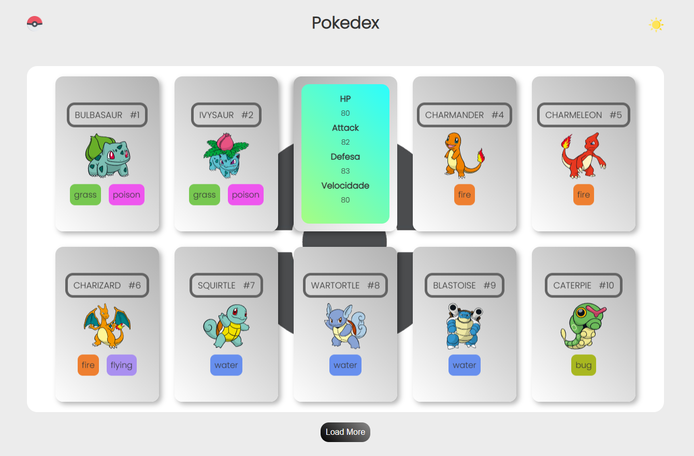

# Trilha JS Developer - Pokedex

  

  Plataforma para listagem de pokémons

  

## 💻 Projeto

Desenvolver uma plataforma web para listagem e visualização de pokémons, para a construção deste projeto foi usado Javascript. Todos os dados sobre os pokémons como nome, número, tipo, imagem e entre outras coisas, foram possíveis com o uso da API REST [PokéApi](https://pokeapi.co/).

### Funcionalidades

- [x] **Listagem dos pokémons**: Listar os pokémons com o uso da API.

- [x] **Ampliar a listagem dos pokémons**: Método para adicionar mais pokémons a lista, ampliando-se a quantia de pokémons mostrada ao usuário.

- [x] **Efeito no cartão do pokémon**: Criar uma animação 3d ao usuário para apresentar a parte de trás dos cards.

- [x] **Informações Básicas**: Dados básicos sobre o pokémon.

- [x] **Modo Escuro**: Funcionalidade para alterar as cores da página. 

### Conceitos abordados

- Uso de flexbox para alinhar e ajustar elementos na página.

- Manipulação de transform no eixo Y para elemento 3d em formato de carta.

- Consumo de api.

- Conceitos de protocolo HTTP.

- Uso do conceito de fetch para alimentação da pokedex.

### Notas

- Ainda em fase de desenvolvimento, novas funcionalidades e otimização do código em breve.

## :rocket: Tecnologias

-  [HTML](https://developer.mozilla.org/pt-BR/docs/Web/HTML)
-  [CSS](https://developer.mozilla.org/pt-BR/docs/Web/CSS)
-  [Javascript](https://developer.mozilla.org/pt-BR/docs/Web/JavaScript)
